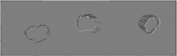
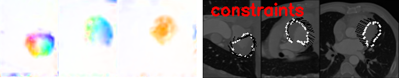

# Flow and Correspondence Utils
A package designed for analyzing 3D optical flow and 3D correspondence results, as well as visualizing and providing common tools for processing them.

## Installation
```bash
pip install git+github.com/shaharzuler/flow_n_corr_utils.git
```

## Key Capabilities:


### Converting Representation Methods

`convert_corr_to_constraints`: Given a confidence correspondence matrix (P), performs smoothing and voxelizes the flow vectors onto a grid. It visualizes the resulting vectors in 3D space.

`flow_to_corr`: Given flow vectors along with target and source point clouds, this function extracts correspondences from them.
It calculates the estimated source coordinates based on the flow field in target coordinates and determines indices of the target point cloud that correspond to the source point cloud using a k-nearest neighbors algorithm.

`corr_cloud_to_flow_cloud`: This function computes flow vectors between two point clouds based on given correspondences. For each correspondence, it calculates the flow vector by subtracting the coordinates of the point in the first point cloud from the coordinates of the corresponding point in the second point cloud. The resulting flow matrix has a shape of [N, 3].


### Interpolation to Fill NaNs/Infs

`interp_to_fill_nans`: This function interpolates all NaN values in a 3D flow field by patchifying and interpolating 2D patches of data (for computational efficiency). After selecting the flow axis and patchifying, it utilizes `interp_missing_values`.

`interp_missing_values`: This function interpolates NaN values along a flow field axis.

`interpolate_from_flow_in_axis`: This function interpolates flow values for voxels containing NaN or Inf values based on nearby finite values. It operates only if the neighboring voxels containing finite values surround the NaN/Inf voxel.


### Flow visualization

`save_contour_flow_sections_visualization`: This function generates visualizations of flow sections, optionally overlaid on images. 



The functions `disp_warped_img`, `add_mask`, `get_mask_contours`, `disp_flow_as_arrows`, `disp_sparse_flow_as_arrows`, `disp_flow_colors` are used for 2D visualization of 3D optical flow and are widely used in our [4DCT cost unrolling repo](https://www.github.com/shaharzuler/four_d_ct_cost_unrolling).




### Other Utilities

`smooth_flow`: This function applies a smoothing operation to flow vectors using a median filter over the nearest neighbors of corresponding point cloud coordinates.

`warp`: This function warps an input image using a given flow field.

`FlowRotator` class: Provides functionality to rotate flow fields using a specified rotation matrix.

`voxelize_flow`: This function voxelizes flow vectors onto a grid based on their corresponding point cloud coordinates.

`attach_flow_between_segs`: This function attaches sparse flow values from the surface of one segmentation map to the nearest neighbors on the surface of another segmentation map.